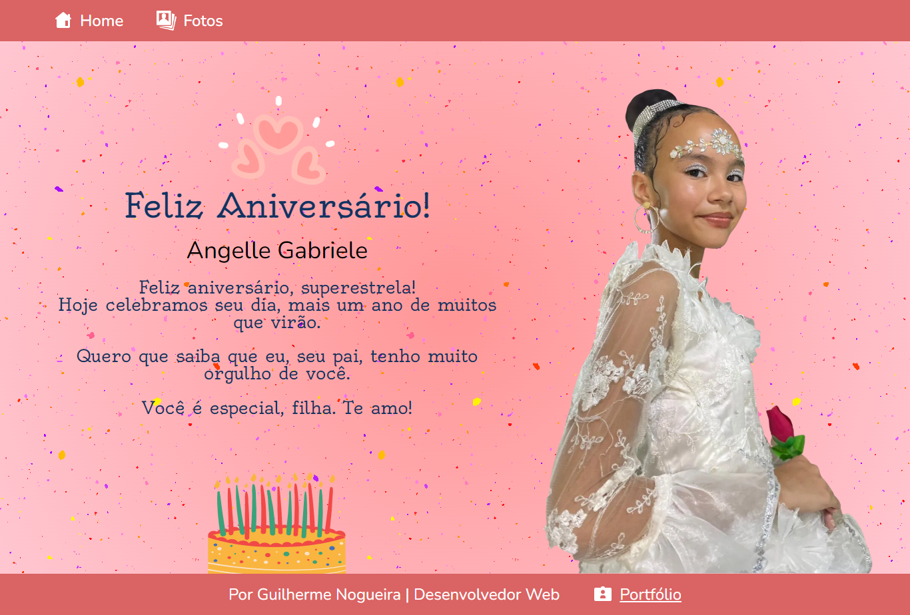
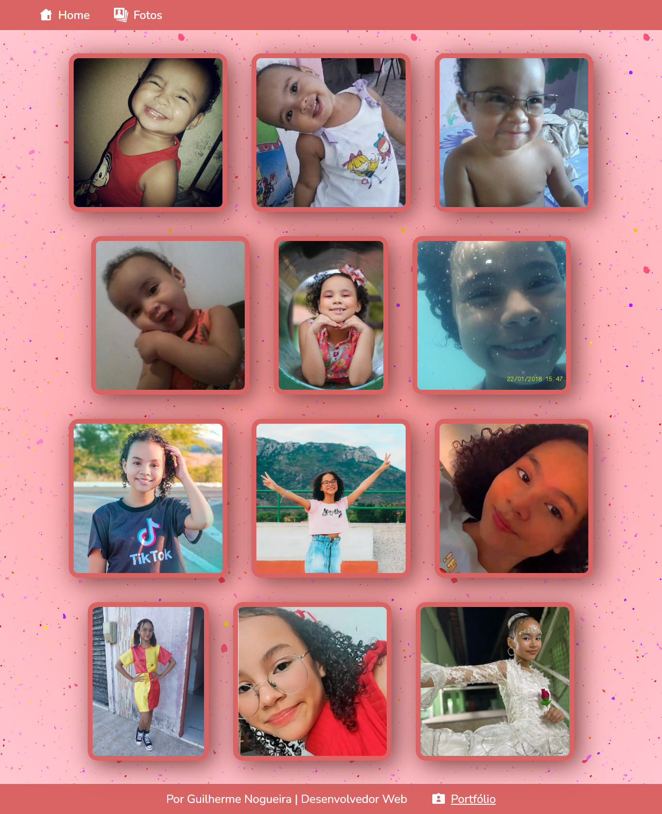
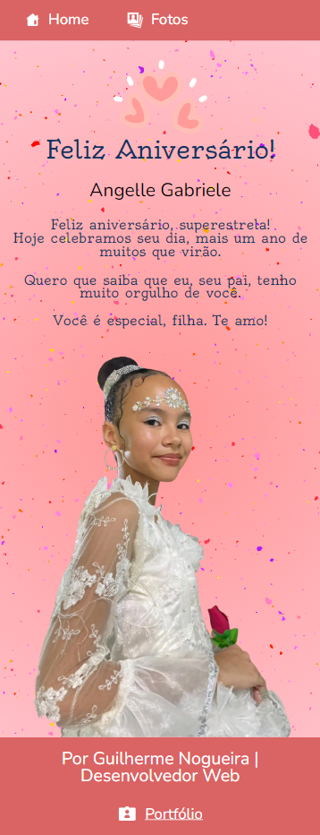

# Página de Cartão de Aniversário: Projeto de Desenvolvimento Front-End
Bem-vindo(a) ao meu projeto de cartão digital de aniversário! Um projeto de desenvolvimento front-end de uma página de presente para aniversariante.

Sou Guilherme Nogueira, estudante de desenvolvimento web na plataforma de ensino online [Alura](https://www.alura.com.br/). Esta é uma das páginas web que desenvolvi praticando front-end, com as linguagens HTML e CSS, após finalizar a formação **A partir do zero: HTML e CSS para projetos web** - [certificado de conclusão](https://cursos.alura.com.br/degree/certificate/d45ed1ca-481e-406e-b20a-852039d6efbb?lang=pt_BR).

---

## Como Visualizar a Página

Você pode visualizar essa página web aqui: 

---

## Sobre o Projeto

Se trata de uma página de cartão digital de aniversário, contendo um **cabeçalho**, **conteúdo principal** com mensagem e **rodapé**. Página completamente responsiva em diferentes tamanhos de tela.

* No **cabeçalho** da página temos o menu de navegação com os links de redirecionamento da página **"Home"** e **"Fotos"**.
* No **conteúdo principal** temos uma foto da aniversariante, um título, texto e gifs animados de corações e confetes.
* Na página **"Fotos"** temos uma galeria com várias fotos da aniversariante.
* Por fim, o **rodapé** com o crédito de desenvolvimento e link para o [portfólio](https://portfolio-seven-taupe-51.vercel.app/).

---

## Responsividade Total em Dispositivos Móveis

A página se adapta em telas de tablets e smartphones de diferentes tamanhos, como você pode ver nessa imagem de visualização completa da página em um smartphone. Todos os elementos são reorganizados para caber perfeitamente na tela.

---

## Linguagens Utilizadas

* HTML
* CSS

## Ferramentas Utilizadas

* Visual Studio Code
* Figma

## Detalhes Técnicos

- Utilizei Flexbox para criar layouts flexíveis e responsivos.
- Implementei Media Queries para adaptar a página a diferentes tamanhos de tela.
- Adotei nomenclatura de classes seguindo a metodologia BEM.

---

## Sobre Mim

Sou um entusiasta da tecnologia e estou focado em me tornar um desenvolvedor full-stack. Atualmente, estou concentrado no estudo do front-end, 
onde estou aprimorando minhas habilidades em HTML, CSS e JavaScript. No entanto, meu objetivo é abraçar todas as camadas do desenvolvimento de 
software, incluindo back-end e data science.

## Minhas Linguagens Mais Usadas

## Contato

Se você tiver alguma dúvida, feedback ou interesse em colaborar em algum projeto, ficarei feliz em conversar: 

## Redes Sociais 
Acesse minhas redes:

    
